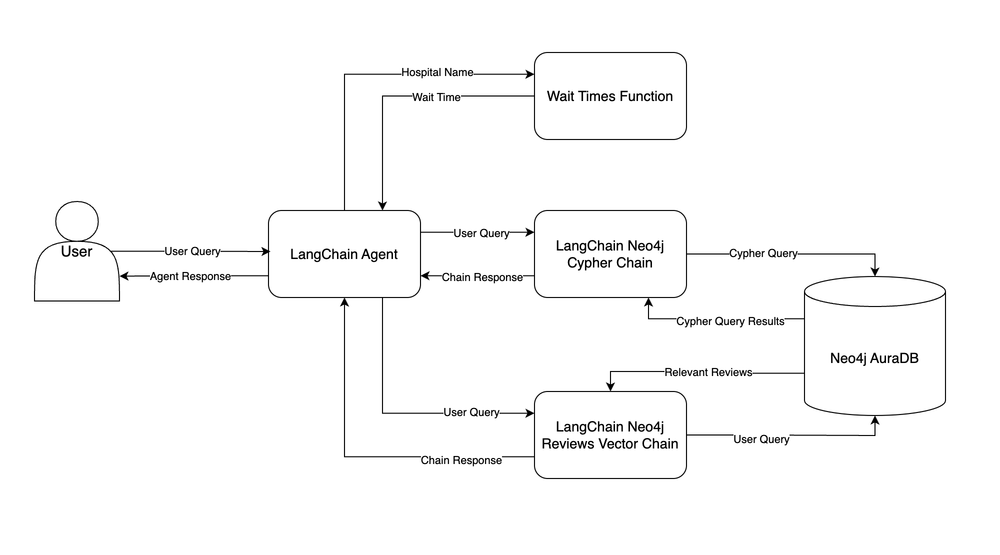

# Hospital Visits ChatBot using LangChain

This repo is the code and data for an AI Agent built using LangChain that answers questions about hospital visits. This includes questions around physicians, visits, insurance payers, patient reviews and hospitals.

## Getting Started

Git clone the repo down to your machine.

Create the following folders from the root directory, otherwise neo4j will fail to start with permissions issues:

- ./neo4j
- ./neo4j/logs:/logs
- ./neo4j/config:/config
- ./neo4j/data:/data
- ./neo4j/plugin:/plugins

## High-Level Process for Building

# Identify an open source dataset

Using the [Healthcare Dataset by Prasad Patil](https://www.kaggle.com/datasets/prasad22/healthcare-dataset?resource=download), we create schemas for how this data may be stored in a relational database and generate data to fill in missing areas from the original dataset. This yields the following "tables":

* hospitals
* payers
* physicians
* reviews
* visits        (this table ties together multiple other tables)

# Design System at a High-Level

One challenge among the design is answering subjective versus objective questions such as "How much money did BlueCross pay to hospitals in 2023?" versus "What did patients have to say about how staff communicated with them?" - one should query a database of data from the tables, and the other should query the patient reviews for relevant information.

This results in two different chains for agentic responses such that TODO_COMPLETE_HERE